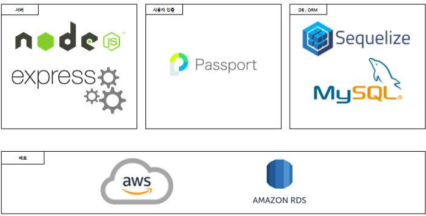

</img> <br/>
슬기로운병영생활      
===========================================

***


### 프로젝트 소개

#### 목적 
군 장병들이 병영생활을 함에 있어 편리함을 제공해줄 수 있는 소규모의 대대급 혹은 중대급 커뮤니티   
병기본, 체력, 사격 등 의 측정 및 시험 일정들을 계획 및 관리함으로 스스로 설계하는 군생활을 보내도록 도와줌.   
그 외에도 마음의 편지, 자유게시판등 소통의 창구로서의 역할도 수행함.


#### 기대효과

+ 1년 반 동안의 군생활 계획을 세우며 특급전사와 같은 목표들을 설정하고, 이루어 나가며 더 보람찬 군생활을 해나갈 수 있을 것입니다.   
그 외에도 마음의 편지 작성, 자유게시판에서의 소통, 전역일 계산기 등 장병들에게 많은 편리함을 줄 수 있습니다.    
+ 대대정도의 단위로 운영되기에, 간부님들은 부대일정에 맞춰 사격, 혹은 체력측정 등의 신청을 받을 수 있을 뿐더러
대대 설문조사등 병사들에게 물어보고 싶은 것을 편하게 묻고, 의견을 수용해나갈 수 있습니다.   
이 뿐만 아니라 간부님들이 자체적으로 게시판을 추가,삭제 할 수 있기에 대대를 운영하는데 많은 도움을 줄 것이라 확신합니다.   

***

### 기능 설명 

+ 병 기본 신청 및 결과 확인

+ 마음의 편지 작성

+ 커뮤니티 이용


***


### 컴퓨터 구성 / 필수 조건 안내(Prerequisites)

 
React는 Internet Explorer 9과 상위 버전을 포함한 모든 주요 브라우저를 지원      
Ckeditor은 인터넷 익스플로러 11을 제외한 모든 주요 브라우저를 지원     
[MYSQL Prerequisites](https://dev.mysql.com/doc/mysql-monitor/8.0/en/prereqs-install-reference.html)     
[AWS Prerequisites](https://docs.aws.amazon.com/ko_kr/quicksight/latest/user/supported-browsers.html)     
권장: Google Chrome 버젼 77 이상   


***

### 기술스택(Technique UseD) 
#### Server(back-end)   

nodejs/ express 프레임 워크를 활용

passport.js 를 통한 로그인 인증 구현

MYSQL 과 Sequelize ORM을 통한 데이터베이스 구축

AWS RDS를 통한 데이터베이스 서버 운영

</img> <br/>


    
#### Client(Front-end)

[react.js](https://ko.reactjs.org/)   
리액트 라이브러리를 이용하여 UI제작     
[Fullcalendar](https://fullcalendar.io/)     
병 기본을 신청함에 있어 달력을 위한 컴포넌트     
[CKEditor](https://ckeditor.com/)        
게시판을 제작하는데 도움을 주는 컴포넌트     
[Chart.js](https://www.chartjs.org/)     
병 기본 결과를 차트로 출력해내기 위한 컴포넌트    


 
***


### 설치안내 (Installation Process)

```
$ git clone https://github.com/osamhack2021/Web_WiseArmyLife_ohabjijol.git
$ yarn or npm install
$ yarn start or npm run start
```


***


### 프로젝트 사용법 (Getting Started) 


마크다운 문법을 이용하여 자유롭게 기재

잘 모를 경우 구글 검색 - 마크다운 문법 https://post.naver.com/viewer/postView.nhn?volumeNo=24627214&memberNo=42458017

편한 마크다운 에디터를 찾아서 사용 샘플 에디터 https://stackedit.io/app#

***


### 팀 정보 (Team Information)
팀 오합지졸

Kim Yong Jin  (hi653@naver.com), Github Id: codrare     
Lee jin jung (hereokay88@gmail.com), Github Id: hereokay88    
Hu Seung Beom (hsb0423@naver.com), Github Id: hsb990423   
Choi Tae Hyun (didls1643@naver.com) Github Id: taehyun08     

***


### 저작권 및 사용권 정보 (Copyleft / End User License)
MIT
This project is licensed under the terms of the MIT license.
